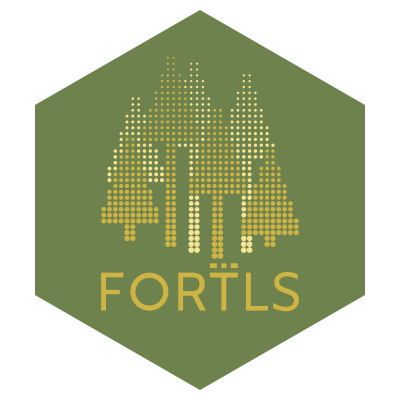

<!-- README.md is generated from README.Rmd. Please edit that file -->

# FORTLS 

<!-- badges: start -->


[](https://cran.r-project.org/package=FORTLS)
[](https://doi.org/10.1016/j.envsoft.2022.105337)


<!-- badges: end -->

## Automatic Processing of Close-Range Technologies Point Cloud Data for Forestry Purposes
Process automation of point cloud data derived from terrestrial-based technologies such as Terrestrial Laser Scanner (TLS) or Mobile Laser Scanner (MLS). 'FORTLS' enables (i) detection of trees and estimation of tree-level attributes (e.g. diameters and heights), (ii) estimation of stand-level variables (e.g. density, basal area, mean and dominant height), (iii) computation of metrics related to important forest attributes estimated in Forest Inventories (FIs) at stand-level, and (iv) optimization of plot design for combining TLS data and field measured data. Documentation about 'FORTLS' is described in Molina-Valero et al. (2022, <https://doi.org/10.1016/j.envsoft.2022.105337>).

Get the lat stable version of FORTLS from GitHub (included in the master branch)

```r
remotes::install_github("Molina-Valero/FORTLS", ref = "devel", dependencies = TRUE)
library(FORTLS)
install_fortls_python_deps()
```

# Taller de manejo de nubes de puntos forestales - 9CFE

## Materiales y datos

[Materiales y datos](https://drive.google.com/drive/folders/1lBoe4XIYFdUfPUCAZ3KGU6JhrosPfoY6?usp=sharing)

## Instalación de FORTLS

```r
install.packages("FORTLS")
library(FORTLS)
install_fortls_python_deps()
```

## Establecimiento del directorio de trabajo

Es **extremadamente importante** que el directorio de trabajo (p. ej. "C:\taller_FORTLS") coincida con el directorio donde se encuentran los datos de origen (nubes de puntos en formato LAS o LAZ). Recordad que en R los directorios se escriben con la barra inclinada u oblícua ( / ).

```r
setwd("C:/taller_FORTLS")

```

## Normalización de la nube de puntos

Esta función (normalize) se utiliza para obtener coordenadas relativas al centro de la parcela especificado para las nubes de puntos del Escáner Láser Terrestre (TLS) y del Escáner Láser Móvil (MLS) (suministradas como archivos LAS o LAZ). A continuación se describen los argumentos utilizados en la función normalizar:

las: texto que contiene el nombre del archivo LAS/LAZ perteneciente a la nube de puntos, incluiyendo las extensiones del archico (.las/.laz).

id: identificación opcional de la parcela, codificada como texto o de forma numérica.

dist.max: distancia horizontal máxima (m) considerada desde el centro de la parcela.

scan.approach: argumento que indica el tipo de escaneo realizado, tanto para escaneos únicos de TLS ('single') como múltiples o nubes de puntos generadas con escáner láser móvil (MLS) ('multi').

```r
pcd <- normalize(las = "HLS_LiGrip.laz",
                 id = "HLS_LiGrip",
                 max.dist = 12.5,
                 scan.approach = "multi")
```

## Variables de árbol individual (o dendrométricas)

Esta función (tree.detection.multi.scan) detecta árboles a partir de nubes de puntos correspondientes a escaneos múltiples de TLS o nubes de puntos generadas con escáner láser móvil (MLS). Para cada árbol detectado, la función calcula las coordenadas centrales de la sección normal y estima el diámetro a 1,3 m sobre el nivel del suelo (lo que se conoce como dbh, diámetro a la altura del pecho), así como otras variables deárbol individual (altura total, volumen del fuste, etc.); clasificando el árbol como totalmente visible o parcialmente ocluido. A continuación se describen los argumentos utilizados en la función tree.detection.multi.scan:

data: data frame obtenido tras ejecutar la función normalize.

understory: argumento opcional para indicar si hay vegetación densa en el sotobosque.

```r
tree.tls <- tree.detection.multi.scan(data = pcd,
                                      threads = parallel::detectCores()-1)
```

## Variables de masa (o dasométricas)

Esta función (metrics.variables) calcula un conjunto de métricas y variables de masa a partir de nubes de puntos tomadas con escáneres terrestres de tecnología LiDAR. Mientras que las métricas puden ser vistas como potenciales variables explicativas en modelos, las variables podrían utilizarse como estimaciones directas de los atributos forestales a nivel de parcela. Esta función puede implementar diferentes diseños de parcela (parcelas circulares de área fija, k-tree y relascópicas) e incluye metodologías para corregir las oclusiones generadas en las nubes de puntos de escaneos únicos de TLS. A continuación se describen los argumentos utilizados en la función metrics.variables:

tree.tls: data frame obtenido tras ejecutar la función tree.detection.multi.scan.

scan.approach: argumento que indica el tipo de escaneo realizado, tanto para escaneos únicos de TLS ('single') como múltiples o nubes de puntos generadas con escáner láser móvil (MLS) ('multi').

plot.parameters: data frame que contiene los parámetros para definir los diseños de parcela de área fija circular (radio en m), k-tree (k) y relascópica (BAF).

```r
met.var.TLS <- metrics.variables(tree.tls = tree.tls,
                                 scan.approach = "multi",
                                 plot.parameters = data.frame(radius = 10, k = 10, BAF = 2))
                                 
# Parcela circular de área fija (10 m de radio)
parcela.circular <- met.var.TLS$fixed.area

# Parceka k-tree (k = 10)
parcela.k.tree <- met.var.TLS$k.tree

# Parcela relascópica (BAF = 2)
parcela.relascopica <- met.var.TLS$angle.count
```

# Acknowledgements 

**FORTLS** it is being developed at [Czech University of Life Sciences Prague] and [University of Santiago de Compostela](https://www.usc.gal/en).

Development of the `FORTLS` package is being possible thanks to the following fellowships/projects:

* Climate Change Adaptation of Forests in the Brdy Highland [LIFE21-CCA-CZ-LIFE-Adapt-Brdy/101074426]
* Design of forest monitoring systems on a regional scale [ED431F 2020/02] supported by the Regional Government of Galicia
* Ramón Areces Foundation Grants for Postdoctoral Studies [XXXV Call for Expansion of Studies Abroad in Life and Matter Sciences](https://www.fundacionareces.es/fundacionareces/es/tratarAplicacionInvestigador.do?paginaActual=2&idConvocatoria=2770&tipo=2)

<p align = "center">
   
   
   
  
</p>


