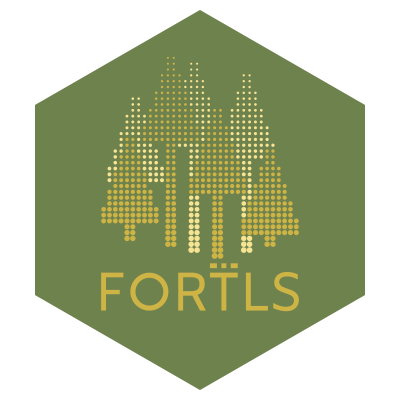

<!-- README.md is generated from README.Rmd. Please edit that file -->

# FORTLS 

<!-- badges: start -->


[](https://cran.r-project.org/package=FORTLS)
[](https://doi.org/10.1016/j.envsoft.2022.105337)


<!-- badges: end -->

## Automatic Processing of Close-Range Technologies Point Cloud Data for Forestry Purposes
Process automation of point cloud data derived from terrestrial-based technologies such as Terrestrial Laser Scanner (TLS) or Mobile Laser Scanner (MLS). 'FORTLS' enables (i) detection of trees and estimation of tree-level attributes (e.g. diameters and heights), (ii) estimation of stand-level variables (e.g. density, basal area, mean and dominant height), (iii) computation of metrics related to important forest attributes estimated in Forest Inventories (FIs) at stand-level, and (iv) optimization of plot design for combining TLS data and field measured data. Documentation about 'FORTLS' is described in Molina-Valero et al. (2022, <https://doi.org/10.1016/j.envsoft.2022.105337>).

Get the lat stable version of FORTLS from GitHub (included in the master branch)

```r
remotes::install_github("Molina-Valero/FORTLS", ref = "devel", dependencies = TRUE)
library(FORTLS)
install_fortls_python_deps()
```

# Taller de manejo de nubes de puntos forestales - 9CFE

## Materials and data

[Materials and data](https://drive.google.com/drive/folders/1lBoe4XIYFdUfPUCAZ3KGU6JhrosPfoY6?usp=sharing)

## Installing FORTLS

```r
install.packages("FORTLS")
library(FORTLS)
install_fortls_python_deps()
```

## Setting the working directory

It is **extremely important**that the working directory (for example, "C:\taller_FORTLS") matches the directory where the source data are located (point clouds in LAS or LAZ format). Remember that in R, directories are written with a forward slash ( / ).

```r
setwd("C:/taller_FORTLS")

```

## Point cloud normalization

This function (normalize) is used to obtain coordinates relative to the plot center specified for point clouds from the Terrestrial Laser Scanner (TLS) and the Mobile Laser Scanner (MLS) (provided as LAS or LAZ files). The arguments used in the normalize function are described below:

las: text containing the name of the LAS/LAZ file belonging to the point cloud, including the file extension (.las/.laz).

id: optional plot identification, encoded as text or numerically.

dist.max: maximum horizontal distance (m) considered from the plot center.

scan.approach: argument indicating the type of scan performed, either single TLS scans ("single") or multiple scans / point clouds generated with a mobile laser scanner (MLS) ("multi").

```r
pcd <- normalize(las = "HLS_LiGrip.laz",
                 id = "HLS_LiGrip",
                 max.dist = 12.5,
                 scan.approach = "multi",
                 threads = parallel::detectCores()-2)
```

## Tree-level variables (or dendrometric variables)

This function (tree.detection.multi.scan) detects trees from point clouds corresponding to multiple TLS scans or point clouds generated with a mobile laser scanner (MLS). For each detected tree, the function calculates the central coordinates of the normal section and estimates the diameter at 1.3 m above ground level (known as DBH, diameter at breast height), as well as other individual-tree variables (total height, stem volume, etc.); classifying the tree as fully visible or partially occluded. The arguments used in the tree.detection.multi.scan function are described below:

data: data frame obtained after running the normalize function.

understory: optional argument indicating whether there is dense understory vegetation.

```r
tree.tls <- tree.detection.multi.scan(data = pcd,
                                      threads = parallel::detectCores()-2)
```

## Stand-level variables (or dasometric variables)

This function (metrics.variables) calculates a set of metrics and stand variables from point clouds acquired with terrestrial LiDAR scanners. While the metrics can be viewed as potential explanatory variables in models, the variables could be used as direct estimates of forest attributes at plot level. This function can implement different plot designs (fixed-area circular plots, k-tree, and angle-count plots) and includes methodologies to correct for occlusions generated in point clouds from single TLS scans. The arguments used in the metrics.variables function are described below:

tree.tls: data frame obtained after running the tree.detection.multi.scan function.

scan.approach: argument indicating the type of scan performed, either single TLS scans ("single") or multiple scans / point clouds generated with a mobile laser scanner (MLS) ("multi").

plot.parameters: data frame containing the parameters used to define fixed-area circular plot designs (radius in m), k-tree (k), and angle-count plot (BAF).

```r
met.var <- metrics.variables(tree.tls = tree.tls,
                             scan.approach = "multi",
                             plot.parameters = data.frame(radius = 10, k = 10, BAF = 2))
                                 
# Parcela circular de área fija (10 m de radio)
parcela.circular <- met.var$fixed.area

# Parceka k-tree (k = 10)
parcela.k.tree <- met.var$k.tree

# Parcela relascópica (BAF = 2)
parcela.relascopica <- met.var$angle.count
```

# Acknowledgements 

**FORTLS** it is being developed at [Czech University of Life Sciences Prague] and [University of Santiago de Compostela](https://www.usc.gal/en).

Development of the `FORTLS` package is being possible thanks to the following fellowships/projects:

* Climate Change Adaptation of Forests in the Brdy Highland [LIFE21-CCA-CZ-LIFE-Adapt-Brdy/101074426]
* Design of forest monitoring systems on a regional scale [ED431F 2020/02] supported by the Regional Government of Galicia
* Ramón Areces Foundation Grants for Postdoctoral Studies [XXXV Call for Expansion of Studies Abroad in Life and Matter Sciences](https://www.fundacionareces.es/fundacionareces/es/tratarAplicacionInvestigador.do?paginaActual=2&idConvocatoria=2770&tipo=2)

<p align = "center">
   
   
   
  
</p>


