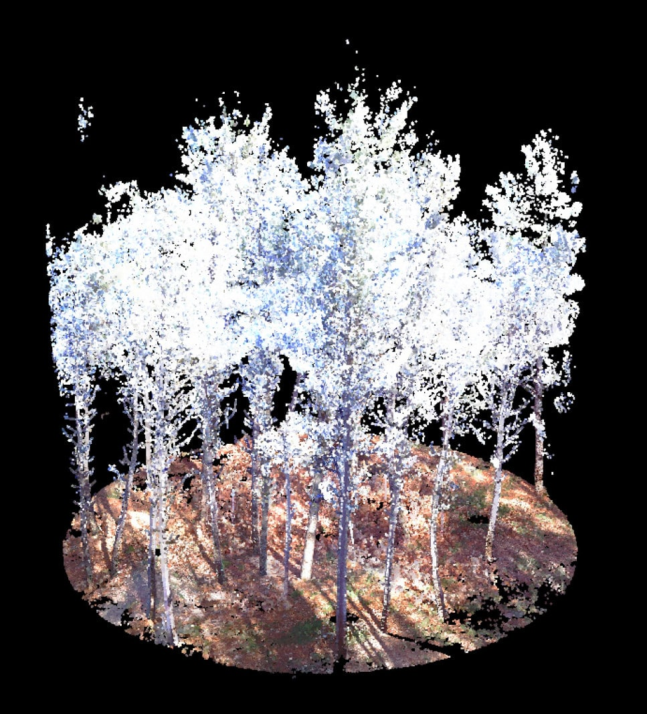
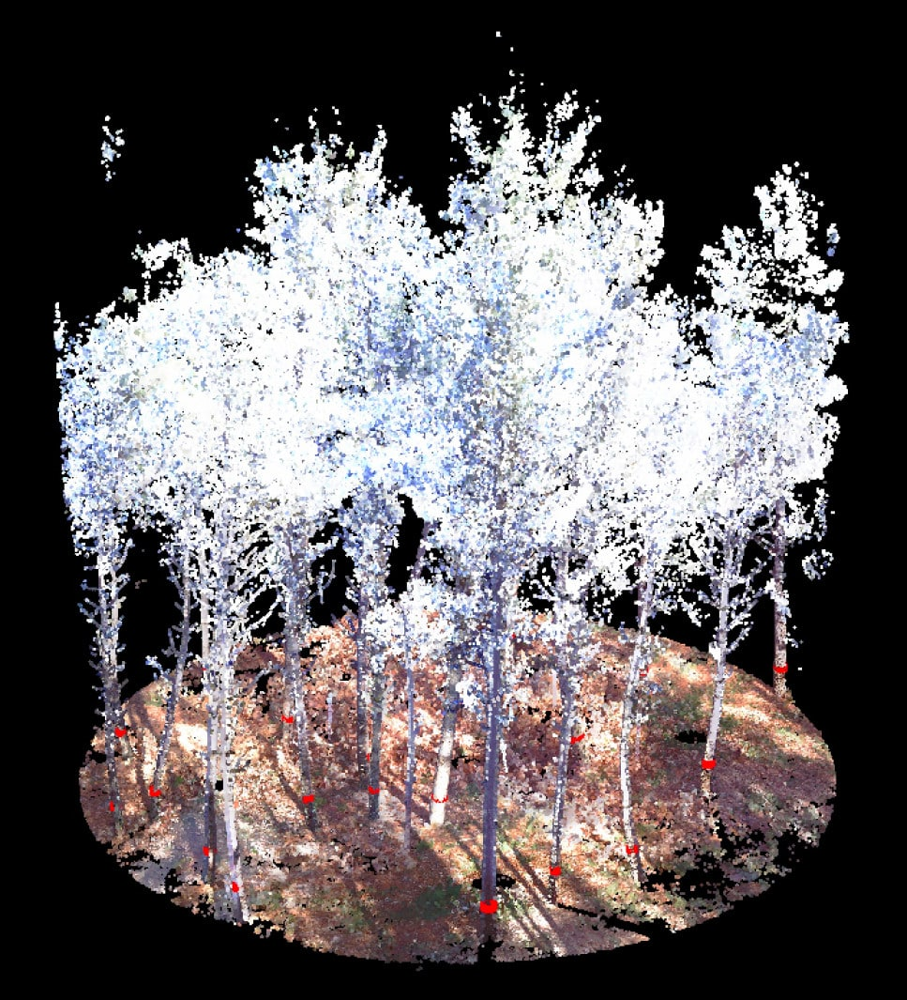

```{r setup, include = FALSE}
knitr::opts_chunk$set(
  collapse = TRUE,
  comment = "#>"
)
```

FORTLS is used for processing of point cloud data derived from terrestrial-based technologies such as Terrestrial Laser Scanning (TLS) or Simultaneous Localization and Mapping (SLAM). Point cloud data must be provided as .las or .laz files. The first obligatory step is the normalization of the point cloud applying the function `normalize`. The obtained normalized point clouds serve as input data for the tree detection functions `tree.detection.single.scan`, `tree.detection.multi.scan` and `tree.detection.several.plots`. The function `tree.detection.single.scan` detects trees from normalized TLS single-scan data and `tree.detection.multi.scan` from normalized TLS multi-scan (or SLAM) data. If data from more than one plot are to be analyzed automatically, the function `tree.detection.several.plots` should be used, which includes both the normalization and the tree detection functions and executes these functions on each input plot sequentially. 

```{r include=FALSE}
dir.data <- getwd()
download.file("https://www.dropbox.com/s/4qvrh7tp3kq0hyo/Galicia_single_scan.laz?dl=1",
              destfile = file.path(dir.data, "Galicia_single_scan.laz"),
              mode = "wb")
download.file("https://www.dropbox.com/s/i905wj0lavklczb/Galicia_multi_scan_red.laz?dl=1",
              destfile = file.path(dir.data, "Galicia_multi_scan.laz"),
              mode = "wb")
download.file("https://www.dropbox.com/s/xg0qme298dwzrxu/Rioja_1.laz?dl=1",
              destfile = file.path(dir.data, "Rioja_1.laz"),
              mode = "wb")
download.file("https://www.dropbox.com/s/tkakwgqt5kgvb9c/Rioja_2.laz?dl=1",
              destfile = file.path(dir.data, "Rioja_2.laz"),
              mode = "wb")
library(FORTLS)
```

## Normalization

The aim of the normalization process is to obtain the coordinates relative to the plot's center and the ground level. In this process, the functions `readLAS`, `clip_circle`, `classify_ground`, `grid_terrain` and `normalize_height` from the [lidR](https://CRAN.R-project.org/package=lidR) package are used internally (Roussel et al., 2020^[Roussel, J.R., Auty, D., Coops, N.C., Tompalski, P., Goodbody, T.R.H., Sanchez Meador, A., Bourdon, J.F., de Boissieu, F., Achim, A., 2020. lidR: an R package for analysis of Airborne Laser Scanning (ALS) data. Remote Sens. Environ. 251, 112061 https://doi.org/10.1016/j.rse.2020.112061.]). The following steps are executed:

- Classification of points as "ground" or "not ground" by the cloth simulation filter (CSF) algorithm (Zhang et al., 2016^[Zhang, W., Qi, J., Wan, P., Wang, H., Xie, D., Wang, X., Yan, G., 2016. An easy-to-use airborne LiDAR data filtering method based on Cloth simulation. Rem. Sens. 8 (6), 501. https://doi.org/10.3390/rs8060501.])
- Generation of a digital terrain model (DTM) by spatial interpolation of the points classified as "ground"
- Normalization of the point cloud by subtracting the DTM and computation of the Cartesian, cylindrical and spherical coordinates 
- Reduction of the density of the point cloud. In case of single-scan approach data, the densitiy is reduced by the point cropping (PCP) algorithm (Molina-Valero et al., 2019^[Molina Valero, J.A., Ginzo Villamayor, M.J., Novo Pérez, M.A., Álvarez-González, J.G., Pérez-Cruzado, C., 2019. Estimación del área basimétrica en masas maduras de Pinus sylvestris en base a una única medición del escáner láser terrestre (TLS). Cuad. Soc. Esp. Cienc. For. 45 (3), 97–116. https://doi.org/10.31167/csecfv0i45.19887.]) and in the case of multi-scan approach data, the point density reduction is based on random selection of points

The following figure shows the normalized point cloud which is used as example data below. The function `plot` from the [lidR](https://CRAN.R-project.org/package=lidR) package is used to generate the figure. 

```{r eval = FALSE, include = TRUE}
multiLAS <- readLAS(paste(dir.data, "Galicia_multi_scan.laz", sep = "/"))
lidR::plot(multiLAS, color = "RGB")
```



### The arguments of `normalize`

The `normalize` function is applied as follows:

```{r eval = TRUE, include = TRUE}
pcd.single <- normalize(las = "Galicia_single_scan.laz", 
                 normalized = NULL,
                 x.center = 0, y.center = 0,
                 max.dist = 15, min.height = NULL, max.height = NULL, 
                 algorithm.dtm = "knnidw", res.dtm = 0.2,
                 csf = list(cloth_resolution = 0.5),
                 RGB = TRUE,
                 scan.approach = "single",
                 id = NULL, file = "single.txt",
                 dir.data = dir.data, save.result = FALSE, dir.result = NULL)
```

The name of the .las or .laz file containing the point cloud data is introduced in **`las`** argument and must include the .las/.laz extension. Optionally, the plot identification number (**`id`**) and the file name (**`file`**) can be defined. Both are set to `NULL` by default, which assigns `1` to the plot identification number and `1.txt` (same name as the identification number) to the reduced point cloud saved in the working directory specified in `dir.result`.

The directory of the input .las/.laz files and the output file can be specified in **`dir.data`** and **`dir.result`** respectively. If not specified, the current working directory is used. The output .txt files containing the reduced point clouds will be saved if not otherwise specified in **`save.result`** (`save.result = TRUE` by default).

If the point cloud in the input file was already normalized, the argument **`normalized`** can be set to `normalized = TRUE` (default setting `normalized = NULL`). As a result, one part of the internal normalization process is skipped. Furthermore the scanning approach applied for data collection must be specified in **`scan.approach`** with `"single"` (set by default) indicating the TLS single-scan approach and `"multi"` indicating the TLS multi-scan and SLAM point clouds approaches.

#### Defining the point cloud

The planimetric coordinates $x$ and $y$ of the center are by default `x.center = 0` and `y.center = 0`. If this does not coincide with the point cloud data, the coordinates of the plot center must be specified by **`x.center`** and **`y.center`**. 

Furthermore the size of the point cloud can be reduced by the arguments **`max.dist`**, **`min.height`** and **`max.height`**. If the maximum horizontal distance in meter to the plot center (`max.dist`) is set, points that are further away are discarded. Similarly, the minimum and maximum height in meters (`min.height`, `max.height` respectively) defines which points are discarded, that are those below the minimum height and those above the maximum height relative to the ground level. The default value for all three arguments is `NULL`. Hence, no points are discarded from the point cloud after normalization.

#### Adjusting the algorithms applied in `normalize` function

In order to generate the DTM, two different algorithms can be applied specified by **`algorithm.dtm`**. Spatial interpolation based on a k-nearest neighbor approach with inverse-distance weighting (`knnidw`) is selected by default. The second method is the Delaunay triangulation (`tin`). The resolution of the DTM (**`res.dtm`**) is set to 0.2 m by default but can be adjusted manually. 

To adjust the CSF algorithm, a list with parameters (e.g. the cloth resolution which is set to 0.5 by default) can be introduced in **`csf`**.

When the point clouds are colorized, the RGB values can be used to improve the normalization and tree detection process (**`RGB`**). The colors serve to distinguish leaf from ground and stem points by the Green Leaf Algorithm (GLA, Louhaichi et al., 2001^[Louhaichi, M., Borman, M. M., & Johnson, D. E. (2001). Spatially located platform and aerial photography for documentation of grazing impacts on wheat. Geocarto International, 16(1), 65-70. doi:10.1080/10106040108542184]). If the GLA algorithm should be applied to remove some points from the point cloud (i.e. leaf points), it must be indicated by `RGB = TRUE`.

### The output data frame

The `normalize` function generates the data frame shown below. Each row corresponds to one point of the point cloud of the input data. The columns `id`, `file` and `point` indicate the plot identification number, the file name and the point number respectively. The following columns contain the normalized Cartesian, cylindrical and spherical coordinates `x` (distance on x axis in m), `y` (distance on y axis in m), `z` (height relative to ground level in m), `rho` (horizontal distance in m), `phi` (angle in rad), `r` (radial distance in m) and `theta` (polar angle in rad). The column `slope` displays the slope of the terrain given in rad. If the GLA algorithm was used, the column `GLA` shows the results of that algorithm. Furthermore, a selection probability is assigned to each point by applying the PCP algorithm (`prob`) and the column `prob.select` shows the selected plots (indicated with 1) and discarded points (indicated with 0).

```{r eval = FALSE, include = TRUE}
head(pcd.single)
```

```{r echo=FALSE}
kableExtra::scroll_box(kable_input = kableExtra::kable(head(pcd.single), format = "html"), 
                       width = "100%")
```

The .txt file saved to the directory indicated by `dir.result` (if `save.result = TRUE`) contains a similar data frame to that shown above. However, the data frame will only include the reduced point cloud, i.e. only the selected points (`prob.select = 1`). The data frame is saved without row names as .txt file by using the `vroom_write` function of the [vroom](https://CRAN.R-project.org/package=vroom) package.

## Tree detection

The tree detection functions include algorithms to detect as many trees as possible in the point clouds. Additionally, the diameter at 1.3 m above ground level (diameter at breast height, $dbh$) is estimated and the coordinates of the tree's center are calculated for each detected tree. Depending on the TLS approach, different tree detection functions should be used.

### Data from TLS single-scan approach

When the single-scan approach was used to collect the data, the function `tree.detection.single.scan` can be applied as follows:

```{r eval = TRUE, warning=FALSE, include=TRUE}
tls.resolution = list(point.dist = 6.34, tls.dist = 10)

tree.list.single.tls <- tree.detection.single.scan(data = pcd.single,
                           dbh.min = 4, dbh.max = 200, h.min = 1.3,
                           ncr.threshold = 0.1,
                           tls.resolution = tls.resolution,
                           d.top = NULL,
                           plot.attributes = NULL,
                           breaks = c(1.0, 1.3, 1.6), stem.section = c(1,5),
                           save.result = FALSE, dir.result = NULL)
```

The normalized and reduced point cloud, i.e. the output of the `normalize` function, is the input data frame for this function (**`data`**). The different arguments that can be specified are explained below.

#### Defining the range of diameters and heights of possible trees

With **`dbh.min`** and **`dbh.max`**, the range of possible tree diameters can be specified. Hence, only  cluster of points with a bigger diameter than `dbh.min` and a smaller diameter than `dbh.max` will be considered as possible trees. Additionally, **`min.height`** defines the minimum height of a possible tree or point cluster to be considered as a tree. If not manually specified, the values are set to `dbh.min = 4`, `dbh.max = 200` (values in cm) and `h.min = 1.3` (value in m).

#### Resolution of the TLS 

The resolution of the TLS scan (**`tls.resolution`**) can be defined either by the aperture angle or the distance between to consecutive points. The aperture angle is determined by the horizontal and vertical aperture angles (`horizontal.angle` and `vertical.angle`). When choosing the angle to define the TLS resolution, both elements must be part of the list required in `tls.resolution = list(horizontal.angle, vertical.angle)`. The second option to determine the resolution considers the distance of two consecutive points (`point.dist`) at a certain distance from the TLS device (`tls.dist`) also given in a list as it is shown in the example above.

#### Including further information about the plots

In **`plot.attributes`** a data frame with attributes at plot level (e.g. strata) can be inserted for additional information. This data frame must contain a column named `id` coinciding with that used in the `id` argument of the function `normalize`. If there are strata, the column specifying the strata must be named `stratum` (numeric) for other functions (e.g., `estimation.plot.size` or `metrics.variables`). If this argument is not specified, it will be set to NULL by default and the function will not add possible plot attributes.

#### Algorithm to distinguish stem points and foliage points

In order to distinguish stem points from points belonging to thin branches or foliage, the local surface variation, also known as normal change rate (NCR) is calculated for each point. This is a quantitative measure of the curvature feature (Pauly et al., 2002^[Pauly, M., Gross, M., & Kobbelt, L. P., (2002). Efficient simplification of point-sampled surfaces. In IEEE Conference on Visualization. (pp. 163-170). Boston, USA. https://doi.org/10.1109/VISUAL.2002.1183771]). For each point, the NCR index is estimated in a local neighborhood with a radius of 5 cm. This radius is considered as suitable for the stem separation in forests (Ma et al. 2015^[Ma, L., Zheng, G., Eitel, J. U., Moskal, L. M., He, W., & Huang, H. (2015). Improved salient feature-based approach for automatically separating photosynthetic and nonphotosynthetic components within terrestrial lidar point cloud data of forest canopies. IEEE Transactions Geoscience Remote Sensing, 54(2), 679-696. https://doi.org/10.1109/TGRS.2015.2459716]; Xia et al., 2015^[Xia, S., Wang, C., Pan, F., Xi, X., Zeng, H., & Liu, H. (2015). Detecting stems in dense and homogeneous forest using single-scan TLS. Forests. 6(11), 3923-3945. https://doi.org/10.3390/f6113923]). Higher NCR values indicate more curved surfaces e.g. branches and foliage. Therefore, a threshold (**`ncr.threshold`**) is established, which can be modified manually. By defalut it is set to 0.1 according to Zhang et al. (2019^[Zhang, W., Wan, P., Wang, T., Cai, S., Chen, Y., Jin, X., & Yan, G. (2019). A novel approach for the detection of standing tree stems from plot-level terrestrial laser scanning data. Remote Sens. 11(2), 211. https://doi.org/10.3390/rs11020211]), meaning that points with a higher NCR value than that threshold are discarded. 

#### Algorithms for identification of trees

In order to improve the detection of trees, the point cloud is reduced by removing parts of it with no trees. The argument **`stem.section`** serves to identify the part of the point cloud, i.e. a range of the coordinate $z$, which contains less bushes, branches or other disruptive points. Hence, a range of the coordinate $z$ and therefore a belt-like area is selected, either by defining the range manually or by an internal algorithm. This belt-like area includes predominantly the stems of the trees. Within this horizontal area, point clusters with higher density are chosen, which are supposedly the stems of the trees. Applying a circular buffer around the stems, vertical cylinders are created, which contain the stems. In the following algorithms only these vertical cylindrical parts of the point cloud are used to detect trees.

After the cylinders have been selected from the point cloud, **`breaks`** defines the height (in m) of horizontal slices on which the tree detection algorithms are applied. If not otherwise specified, slices are taken every 0.3 m starting at a height of 0.4 m until reaching the maximum height. The slices have a extension of 0.1 m (height of slice +/- 5 cm). On each slice the following algorithms are applied:

- **Removal of branches and foliage:** The NCR values are calculated for each point and only those points are kept as stem points with a NCR value lower than the predefined threshold (`ncr.threshold`)
- **Clustering of the points:** The clustering process is applied on the horizontal projection of the point's Cartesian coordinates i.e., only their $x$ and $y$ coordinates are considered. The Density-Based Spatial Clustering of Applications based on the Noise (DBSCAN) method (Ester et al., 1996^[Ester, M., Kriegel, H.P., Sander, J., Xu, X., (1996). A density-based algorithm for discovering clusters in large spatial databases with noise. In Kdd 96 (34), 226–231.]) implemented by the `dbscan` function of the [dbscan](https://CRAN.R-project.org/package=dbscan) package is used to perform the clustering. The radius of the epsilon neighborhood (`eps`) is defined as the minimum distance between two consecutive points at the furthest distance from the plot center in the respective horizontal slice
- **Removing of points belonging to remaining branches and foliage:** Two characteristics are used to distinguish stem and branch clusters. First, the density of stem sections is higher than of branch and foliage sections. And second, stem points should have a predominant vertical distribution. Hence, when the point cloud is vertical projected and dissected into a grid, cells over stems have a higher point density than cells over leafs or branches. Points in cells with a lower density than the median density are removed from the point cloud
- **Calculation of the center of the potential tree section:** The center is considered as the point in which the variance of the distances between all cluster points and the potential center point reaches its lowest value
- **Classification of clusters:** In order to decide whether the clusters belong to a tree section, different geometric features are considered. First, the calculated center of the tree section must be located behind the stem point clusters relative to the TLS position. Second, no points should be located behind the tree surface relative to the TLS position.  And third, the clusters should form an arc, which implicates that extreme points should lay further away from the TLS than points in the middle.

As explained above, these algorithms are applied on all horizontal slices (defined by `breaks`). Thus, tree sections are identified at different heights. Those sections that belong to the same tree are joined by applying the DBSCAN algorithm on the horizontal projection of the different sections. Thereafter, tree attributes can be estimated.

#### Estimation of tree attributes

The diameter of the detected trees ($dbh$) is obtained at 1.3 m as the double of radius. If the tree is not detected in the section at 1.3 m, the $dbh$ is estimated by fitting a linear taper function with radius as response variable and the section heights as explanatory variables. Thus, this function allows to estimate the radius at 1.3 m and to calculate $dbh$.

The argument **`d.top`** defines the top stem diameter (in cm), which is used for the calculation of the commercial stem volume. If this argument is not specified, the commercial stem volume (`v.com`) is not calculated.

#### The output data frame

```{r eval = FALSE, include=TRUE}
head(tree.list.single.tls)
```

```{r echo=FALSE}
kableExtra::scroll_box(kable_input = kableExtra::kable(head(tree.list.single.tls), 
                                                       format = "html"), width = "100%")
```

The data frame shown above is the output of the `tree.detect.single.scan` function. Each row represents a detected tree (consecutively numbered in the column `tree`). The columns `id` and `file` display the plot identification number and the file name respectively equal to the columns in the `normalize` output table. The coordinates of the detected trees are given as Cartesian coordinates of the tree's center (`x` and `y`, in m) and azimuthal angles of the center (`phi` in rad), the left border (`phi.left` in rad), the right border (`phi.right` in rad) and the horizontal distance from the tree's center to the plot's center (`h.dist` in m).

Furthermore, the tree attributes `dbh` (diameter at breast height in cm), `h` (total height in m), `v` (tree stem volume in m$^3$) are estimated. If `d.top` was defined as argument, the volume of the stem from the ground to the height of the diameter given in `d.top` is estimated (commercial stem volume, `v.com` in m$^3$). 

For each tree, the number of points of the normal section slice (1.3 m +/- 0.05 m) of the original point cloud and the reduced point cloud (`n.pts` and `n.pts.red` respectively) are calculated and also estimated (`n.pts.est` and `n.pts.red.est` respectively). The column `partial.occlusion` describes whether the the detected tree is partially occluded (1) or not (0).

The data frame is saved as .csv file without row names using the `write.csv` function from the [utils](https://CRAN.R-project.org/package=R.utils) package.

### Data from TLS multi-scan approach

When multiple scans were performed in the same sampling plot (multi-scan approach) or SLAM devices were used, the function `tree.detection.multi.scan` can be applied as follows below. Additionally, the function `normalize` must be adjusted by specifying `scan.approach = "multi"`.

```{r eval = TRUE, warning=FALSE, include=TRUE}
pcd.multi <- normalize(las = "Galicia_multi_scan.laz", 
                 x.center = 0, y.center = 0, RGB = TRUE,
                 scan.approach = "multi", file = "multi.txt",
                 dir.data = dir.data, save.result = FALSE)

tree.list.multi.tls <- tree.detection.multi.scan(data = pcd.multi[pcd.multi$prob.selec == 1, ],
                          dbh.min = 4, dbh.max = 200, h.min = 1.3,
                          ncr.threshold = 0.1,
                          tls.precision = 0.03,
                          breaks = c(1.0, 1.3, 1.6), stem.section = c(1,5),
                          d.top = NULL,
                          plot.attributes = NULL,
                          save.result = FALSE, dir.result = NULL)
```

The function `tree.detection.multi.scan` comes along with the same arguments as the function `tree.detection.single.scan`, which are described in "Data from TLS single-scan approach". However, instead of specifying the resolution, the precision of the TLS (in m) can be defined in `tls.precision`. If not defined, the default value is 0.03 m. The procedure remains the same and the output data frame contains the all the columns explained above:

```{r eval = FALSE, include=TRUE}
head(tree.list.multi.tls)
```

```{r echo=FALSE}
kableExtra::scroll_box(kable_input = kableExtra::kable(head(tree.list.multi.tls), 
                                                       format = "html"), width = "100%")
```

The following figure shows the same point cloud (`"Galicia_multi_scan.laz"`) as above. The trees that were detected by the `tree.detection.multi.scan` function are labeled with a red belt at 1.3 m. 

```{r eval = FALSE, include = FALSE}
diameter <- readLAS(paste(dir.data, "diameters.laz", sep = "/"))
lidR::plot(multiLAS, color = "RGB", add = plot(diameter, color = "Intensity"))
```



### Automatic normalization and tree detection of several plots

If data from multiple plots are to be analysed, the function `tree.detection.several.plots` can be used. This function conducts both normalization and tree detection processes for each plot automatically. The result tables (as explained above) are stored directly and separately for each plot. Hence, if an error occurs in one plot, the results of the previously analysed plots are stored. 

In the function, the arguments for both the `normalize` and `tree.detection` functions must be specified as explained above. The function is applied as follows:

```{r eval = FALSE, include= TRUE}
tls.resolution = list(point.dist = 7.67, tls.dist = 10)

tree.list.tls <- tree.detection.several.plots(las.list = c("Rioja_1.laz", "Rioja_2.laz"), 
                      id = NULL, file = NULL,
                      scan.approach = "multi",
                      x.center = 0, y.center = 0,
                      max.dist = 20, min.height = 0.1, max.height = NULL,
                      algorithm.dtm = "knnidw", res.dtm = 0.2, 
                      csf = list(cloth_resolution = 0.5),
                      
                      dbh.min = 7, dbh.max = 200, h.min = 1.3,
                      tls.resolution = tls.resolution,
                      ncr.threshold = 0.05,
                      breaks = c(0.5, 1, 1.3, 1.6, 2, 2.5, 3),
                      stem.section = c(0.5, 4),
                      d.top = NULL, plot.attributes = NULL,
                      dir.data = dir.data, save.result = FALSE, dir.result = NULL)
```

The names of the .las files have to be introduced as a character vector in **`las.list`**. Optionally, vectors with the plot identification numbers and the file names can be specified in **`id`** and **`file`**. If not specified, the plots will be named with correspondent numbers from 1 to n plots (`id`) and their respective `id` in "id.txt" as file names. The other arguments can be specified as explained in the sections above. 

The input files are analysed successively. After finishing the analysis of one plot, the reduced point cloud as .txt file and the tree list as .csv file are saved to the directory indicated in **`dir.results`**. 

